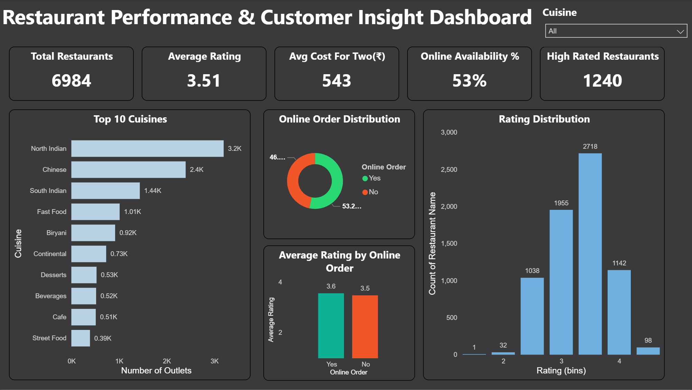

# 📊 Restaurant Performance & Customer Insight Dashboard
This is my first Power BI dashboard project where I explored restaurant data to derive meaningful insights.

 ##🔍 Key Insights
- Customer preferences across cuisines  
- Online vs Offline ordering trends  
- Rating distribution analysis  
- Top cuisines by number of outlets

## 🛠 Tools Used
- Power BI  
- Power Query (Data Cleaning & transformation )  
- DAX (Calculations & Measures)  

## 📁 Dataset
Zomato  dataset sourced from Kaggle  

## 📸 Dashboard Preview

## 💡 What I Learned
- Data cleaning using Power Query  
- Creating interactive dashboards  
- Using slicers and filters  
- Improving dashboard design & alignment
  
